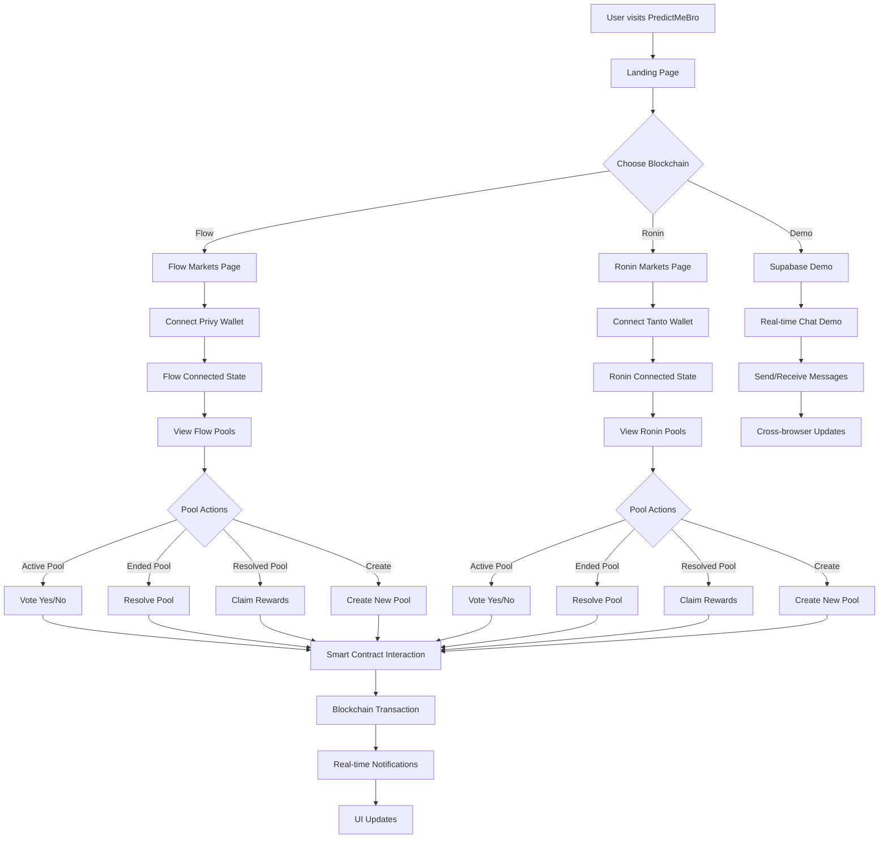

# PredictMeBro - User Flow Diagram

## Overview
PredictMeBro is a decentralized prediction market platform supporting both Flow and Ronin blockchains. It provides real-time anonymous voting on various prediction markets with blockchain-based reward distribution.

## Architecture Components

### Core Technologies
- **Frontend**: React + TypeScript with Vite
- **Routing**: TanStack Router for file-based routing
- **State Management**: TanStack Query for server state
- **Blockchain**: Wagmi for Web3 integration
- **Authentication**: Privy for Flow, Tanto for Ronin
- **Real-time**: Supabase for live notifications
- **Styling**: Tailwind CSS with custom glass effects

### Key Pages & Routes
- `/` - Homepage with platform overview
- `/flow` - Flow blockchain prediction markets
- `/ronin` - Ronin blockchain prediction markets  
- `/supabase-demo` - Real-time messaging demo

## User Flow Diagram



## Detailed User Interactions

### 1. Entry Point & Navigation
```
Homepage (/) 
├── Hero Section with Platform Overview
├── Feature Cards (Simple, Decentralized, Multi-chain, Real-time)
├── Navigation to Flow Markets
├── Navigation to Ronin Markets
└── Navigation to Live Demo
```

### 2. Blockchain-Specific Flows

#### Flow Markets (`/flow`)
```
Flow Page
├── Connect Privy Wallet
├── Real-time Connection Status
├── Create Pool Modal
│   ├── Fill Pool Details (Question, Amount, Duration)
│   ├── Test Data Auto-fill
│   └── Submit to Smart Contract
└── All Pools List
    ├── Active Pools → Vote Yes/No
    ├── Ended Pools → Resolve Pool
    └── Resolved Pools → Claim Rewards
```

#### Ronin Markets (`/ronin`)
```
Ronin Page
├── Connect Tanto Wallet
├── Real-time Connection Status
├── Create Pool Modal (Same as Flow)
└── Ronin Pools List
    ├── Static Pool Examples
    ├── Vote Actions
    ├── Resolve Actions
    └── Claim Actions
```

### 3. Smart Contract Interactions

#### Pool Creation Flow
```
User Input → Validation → Smart Contract Call
├── Question (String)
├── Participation Amount (ETH)
├── Duration (Hours)
├── Creator Address (Wallet)
└── Pool Prize (10x Participation Amount)
```

#### Voting Flow
```
Pool Selection → Vote Choice → Amount Confirmation → Transaction
├── Pool ID (BigInt)
├── Vote (Boolean: Yes/No)
├── Amount (ETH)
└── Wallet Signature
```

#### Reward System
```
Pool Resolution → Winner Calculation → Claim Process
├── Resolve Pool (Admin Action)
├── Determine Winners (Smart Contract)
├── Calculate Rewards (Proportional Distribution)
└── Claim Rewards (Winner Action)
```

### 4. Real-time Features

#### Supabase Integration
```
Real-time Channels
├── Pool Creation Notifications
├── Vote Notifications
├── Cross-device Toast Messages
└── Live Update Synchronization
```

#### Notification Types
- **Pool Created**: Broadcast to all users
- **Vote Cast**: Anonymous voting with live updates
- **Pool Resolved**: Winners announced
- **Rewards Claimed**: Success notifications

### 5. Component Architecture

#### Core Components
```
App Structure
├── Header (Navigation + Wallet Connect)
├── Route Pages (Home, Flow, Ronin, Demo)
├── CreatePoolModal (Pool Creation Form)
├── AllPoolsList (Pool Display Container)
├── PredictionPool (Individual Pool Card)
└── UI Components (Buttons, Cards, Forms)
```

#### Data Flow
```
Smart Contract ↔ useEscrowContract Hook
├── Pool Creation
├── Voting Logic
├── Reward Claims
└── Pool Resolution

Supabase ↔ Real-time Hooks
├── usePoolNotifications
├── useVoteNotifications
├── useRealtimeToasts
└── Cross-browser Sync
```

### 6. State Management

#### Pool State Lifecycle
```
1. Created → Active → Ended → Resolved → Claimed
   ├── Created: Pool initialized on blockchain
   ├── Active: Users can vote
   ├── Ended: Time expired, voting closed
   ├── Resolved: Admin determines winner
   └── Claimed: Winners claim rewards
```

#### Real-time State Sync
```
Local State ↔ Blockchain State ↔ UI State
├── Pool Data Fetching
├── Vote Count Updates
├── Connection Status
└── Transaction Confirmations
```

### 7. Error Handling & Edge Cases

#### Wallet Connection
- No wallet detected
- Wrong network
- Insufficient funds
- Transaction rejected

#### Pool Interactions
- Pool not found
- Already voted
- Pool expired
- No claimable rewards

#### Real-time Issues
- Connection lost
- Message delivery failed
- Cross-browser sync errors

## Technical Implementation Details

### Smart Contract Architecture
- **EscrowPool.sol**: Main prediction market contract
- **Functions**: createPool, vote, resolvePool, claimReward
- **Events**: PoolCreated, VoteCast, PoolResolved, RewardClaimed

### Frontend Architecture
- **File-based Routing**: TanStack Router with type safety
- **Reactive State**: React hooks with custom abstractions
- **Blockchain Integration**: Wagmi + Viem for Web3 interactions
- **Real-time**: Supabase channels for live updates

### Data Models
```typescript
interface Pool {
  id: string
  question: string
  totalAmount: number
  yesVotes: number
  noVotes: number
  endsAt: string
  participationAmount: number
  claimableAmount?: number
  isResolved: boolean
}
```

## Security Considerations

### Smart Contract Security
- Pool creation validation
- Vote amount verification
- Reward calculation integrity
- Access control for resolution

### Frontend Security
- Wallet connection validation
- Input sanitization
- Transaction confirmation
- Error boundary handling

## Future Enhancements

1. **Advanced Pool Types**: Multiple choice, numerical predictions
2. **Reputation System**: User credibility scores
3. **Governance**: Decentralized pool resolution
4. **Mobile App**: Native iOS/Android support
5. **Analytics**: Pool performance metrics
6. **Social Features**: Pool sharing, comments