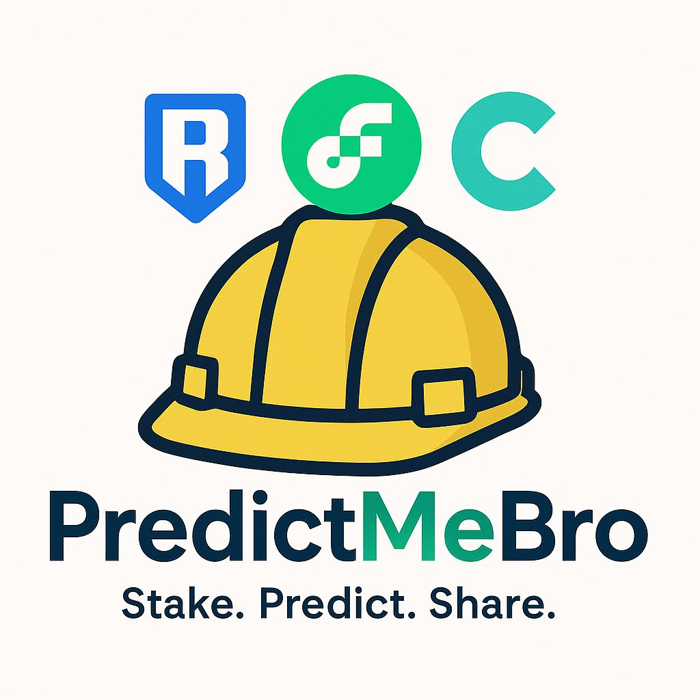

# PredictMeBro

<div align="center">
  
</div>

A decentralized sentiment prediction market platform where users can vote "Yes" or "No" on various predictions and market outcomes. Built with Next.js, Socket.IO for real-time updates, and Wagmi for Ethereum wallet integration.

## The Problem We Solve

🔍 **Lack of Accessible Prediction Markets**
- Traditional prediction markets are complex and intimidating for everyday users
- High barriers to entry with complicated interfaces and processes
- Limited real-time engagement and community interaction

📊 **Unreliable Sentiment Data**
- Current sentiment analysis tools lack human intuition and context
- Centralized platforms can manipulate or bias prediction outcomes
- No transparent way to track collective market sentiment over time

💰 **Missed Opportunities for Crowd Intelligence**
- Individual predictions are often less accurate than collective wisdom
- No easy way to monetize prediction skills and market knowledge
- Limited platforms that combine social sentiment with financial incentives

## Our Solution

✅ **Simple Yes/No Voting Interface**
- Intuitive binary choice system that anyone can understand and use
- Real-time voting results with live updates across all connected devices
- Seamless wallet integration for secure, blockchain-based participation

🌐 **Decentralized & Transparent**
- Blockchain-based voting ensures transparency and immutability
- Real-time synchronization across multiple devices and users
- Community-driven predictions with verifiable on-chain results

⚡ **Gamified Prediction Experience**
- Earn rewards for accurate predictions and active participation
- Social features with live user counts and community engagement
- Beautiful, responsive interface with instant feedback and notifications

## Features

- 🍞 **Sonner Toast**: Beautiful toast notifications with multiple variants
- 🌐 **Socket.IO Integration**: Real-time toast notifications across multiple devices
- 🏦 **Wagmi Integration**: Connect to Ethereum wallets and interact with blockchain
- ⚡ **Next.js 15**: Latest Next.js with App Router
- 🎨 **Tailwind CSS**: Utility-first CSS framework
- 📝 **TypeScript**: Full type safety with Socket.IO event types

## Getting Started

1. Install dependencies:
```bash
pnpm install
```

2. Run the development server:
```bash
pnpm dev
```

3. Open [http://localhost:3000](http://localhost:3000) in your browser.

## Usage

### Toast Notifications with Socket.IO

The app features real-time toast notifications that sync across all connected devices and browser tabs.

**Basic Usage:**
```tsx
import { toast } from "sonner"

// Simple toast
toast("Hello World")

// Success toast
toast.success("Success message", {
  description: "This is a success toast"
})

// Error toast
toast.error("Error message", {
  description: "This is an error toast"
})

// Toast with action
toast("Event created", {
  description: "Sunday, December 03, 2023 at 9:00 AM",
  action: {
    label: "Undo",
    onClick: () => console.log("Undo"),
  },
})
```

**Real-time Synchronization:**
- When you trigger a toast on one device, it appears on all other connected devices
- Toast notifications include a "📱 From another device" indicator for remote toasts
- Connection status is displayed with a live indicator
- Active user count is shown in real-time

### Wagmi Integration

Use Wagmi hooks to interact with Ethereum wallets:

```tsx
import { useAccount, useConnect, useDisconnect } from "wagmi"
import { injected } from "wagmi/connectors"

function WalletComponent() {
  const { address, isConnected } = useAccount()
  const { connect } = useConnect()
  const { disconnect } = useDisconnect()

  return (
    <div>
      {isConnected ? (
        <div>
          <p>Address: {address}</p>
          <button onClick={() => disconnect()}>Disconnect</button>
        </div>
      ) : (
        <button onClick={() => connect({ connector: injected() })}>
          Connect Wallet
        </button>
      )}
    </div>
  )
}
```

## Configuration

### Wagmi Configuration

The Wagmi configuration is located in `src/config/wagmi.ts`:

```tsx
import { http, createConfig } from 'wagmi'
import { mainnet, sepolia } from 'wagmi/chains'

export const config = createConfig({
  chains: [mainnet, sepolia],
  transports: {
    [mainnet.id]: http(),
    [sepolia.id]: http(),
  },
})
```

### Providers Setup

The app is wrapped with necessary providers in `src/app/providers.tsx`:

- **WagmiProvider**: Provides Wagmi context
- **QueryClientProvider**: Provides TanStack Query context for async state management

## Dependencies

- `sonner`: Toast notifications
- `socket.io` & `socket.io-client`: Real-time WebSocket communication
- `wagmi`: React hooks for Ethereum
- `viem`: TypeScript interface for Ethereum
- `@tanstack/react-query`: Async state management
- `ts-node`: TypeScript execution for custom server

## Development

To test the integration:

1. **Toast Demo with Socket.IO**: 
   - Click the toast buttons to see notifications
   - Open the page in multiple tabs/devices to see real-time synchronization
   - Watch the connection status and user count updates

2. **Wagmi Demo**: Connect your wallet (requires MetaMask or similar) to test Ethereum integration

## TypeScript Socket.IO Integration

The app uses a custom TypeScript server (`server.ts`) that integrates Socket.IO with Next.js:

- **Typed Events**: All Socket.IO events are fully typed using TypeScript interfaces
- **Real-time Broadcasting**: Toast events are broadcast to all connected clients
- **Connection Management**: Tracks and displays active user connections
- **Type Safety**: Complete type safety for Socket.IO client and server events

## Learn More

- [Sonner Documentation](https://sonner.emilkowal.ski/)
- [Wagmi Documentation](https://wagmi.sh/)
- [Next.js Documentation](https://nextjs.org/docs)
- [Viem Documentation](https://viem.sh/)
